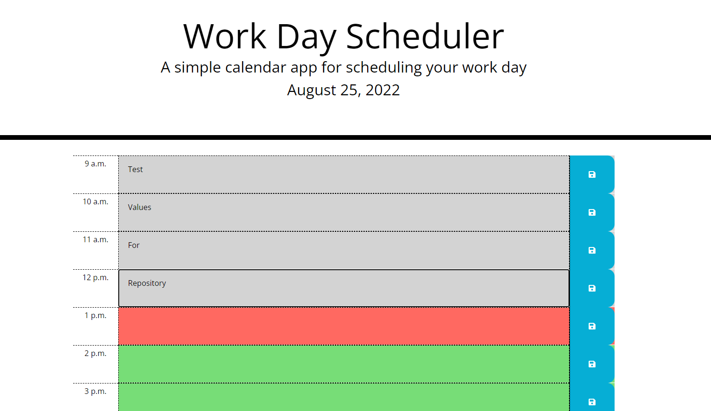

# workday-scheduler

## Table of Contents
1. [Description](#description)
2. [Technology](#technology)
3. [Visuals](#visuals)
4. [Installation](#installation)
5. [License](#license)

## Description
[Link to Live Site](https://zachattack221.github.io/workday-scheduler/)
\
This project is a refactoring of a workday scheduler, one that allows a user to enter and save notes by the hour, in an interactive, color-coded format that scales with Moment.js timestamps. This repository utilizes jQuery & Bootstrap for formatting and functionality, taking advantage of local storage, and demonstrating event delegation in action.

## Technology

## Visuals

## Installation
## License
This application is licensed with the MIT License.